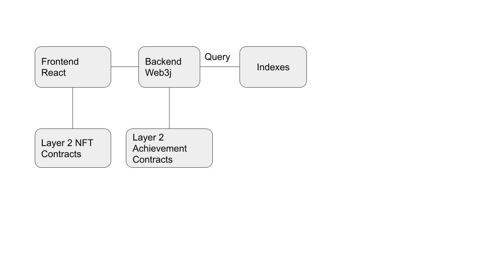

# Defi-Achievements-Overview

If you're looking for a project motivation post see [here](harnessing-collector-psychology-for-good).

Conceptually this is like steam achievements but for on-chain history rather than in-game history.

The short term goal is to make a fun platform for people to explore different things they can do to collect achievements. The long term goal is to build a decentralized identity system for Sybil resistance.

## Architecture Overview

Responsibilities of each component are listed below.

### Frontend

http://app.defiachievements.com

Wherever possible we keep this focused on display and UX logic such as filtering/sorting.

* The landing page helps users to browse their achievements.
* Users can view platforms/tags to discover achievements they haven't unlocked.
* Users can view the full details of an achievement.
* Users can unlock achievements and later will be able to mint an NFT for each unlocked achievement.
* We may later add analytics pages for achievements/nfts about their rarity and such.

### Achievement DAL Backend

http://backend.defiachievements.com/swagger-ui.html

* It's a DAL to the layer 2 blockchain where we manage the achievement struct.
* It provides a search api for browsing achievements.
* It's where we run the eligibility queries for an achievement. This functionality may be migrated to another microservice later.
* It provides an admin API for manual intervention in the system such as disabling mints, deploying new achievements to the chain, etc.

### Indexes

Eligibility queries run against various indexes such as Etherscan API, Alchemy API, Subgraphs, or basic web3j calls if that can do it.

This is not limited to Ethereum L1. I'm perfectly happy to write queries against indexes for other chains as long as there's a supported library or API we can slot into the existing backend.

### L2 Contracts

Achievement contracts contain the metadata about each achievement and tag, map achievements to tags, and map achievements to addresses (the attestation struct).

NFT contracts will be built later enable minting NFT's if users have unlocked an achievement.

## Progress Plans

I hope that during each phase we'll be steadily adding to the query library, onboarding partner platforms, and creating achievements for them. I'm not going to set targets per release phase because that's just going to lead to embarassment.

### Current Status as of Alpha

Currently the achievement structs are deployed to a ganache-cli container running in our private cluster. The dev-ops on this is shoestring. There is no volume mount, so if the container is restarted the state is lost. I could spend time to harden this but eventually we'll be on an L2 and it will be a moot point.

The current backend is written in Java. I'm painfully aware of the limitations compared to the javascript ecosystem. I may split the DAL off into another service using javascript to get access to better libraries, especially as we refactor things as required for L2. I'm comfortable with the eligibility query runner remaining in Java though. The code for that is frankly not as hard and I like Spring's Dependency Injection framework.

The current UI is a barebones display of a single default search function, achievement details, tag details, and an achievement unlock flow. Hopefully we'll get some volunteers to do some actual design on this rather than programmer art we're pushing now.

### Plans for Beta

The main goal of beta is to deploy the contracts on a public L2 instead of running them in the private ganache container on our cluster. The r&d task here is figuring out which L2, how contracts on L1 or other L2's call view functions on that L2, and whether our current contracts are compatible there. In addition to selecting an L2 and updating our toolchain to deploy there this will require a transaction manager for executing transactions in parallel and some ddos protection via message signing and rate limiting eligibility queries per address.

As a stretch goal I'd like to update the contracts to support batch writes and manage the transaction queue using a producer/consumer pattern with microbatches. This will improve gas efficiency.

There's no target date for beta. We may very well have to wait for L2's to evolve a bit while we just work to build up our partner network and our achievement library.

The frontend will probably undergo a facelift at this point too to better facilitate the serendipitous discovery of achievements.

### Plans for Launch

The main goal for the official launch is to build the NFT layer. The trick is to get the NFT contract to be permissionless to call, require gas from the caller, and be integrated into the frontend like a more traditional dapp, but still require the corresponding achievement be unlocked to mint even if the achievement structs are on a different L2. For example the achievement structs may end up on zkporter while the NFT's may end up on ImmutableX. I know its possible to make the contract check a string you would need the owner private key to generate so we may have to do that instead of having the NFT contract invoke a view function on the Achievement struct. We need someone to look into this in depth.

The stretch goal is to figure out how to generate the NFTs in such a way that we can get residual trading revenue from them. A small percentage should be sufficient to pay for the hosting costs of the project in perpetuity.

## DAO

Despite the dev work being mostly centralized to date I would like this to be a community built project over time. In the short term we should setup a multi-sig with the DefiAchievements.eth ENS for partner DAOs to pay for the query + image work of creating Achievements for them. The partner DAOs should provide some ideas for Achievements and funding. We should network them to artists to find an aesthetic fit for the images, refine the descriptions for clarity, build the query code + config, and negotiate KPIs based on engagement targets. I have confidence we'll shape out a scalable process for this if the project takes off at all. Some of the KPIs can be distributed to people from their DAO who wish to market their DAO, DefiAchievements, and drive engagement.

If we start to generate $10k+ a month in residual income then we can talk about a token launch and a more formal implementation for fund governance than a multi-sig.

The main points of centralized control in the meantime are access to the Github Organization and the AWS Account which are both currently privately held by me (/u/LogrisTheBard).