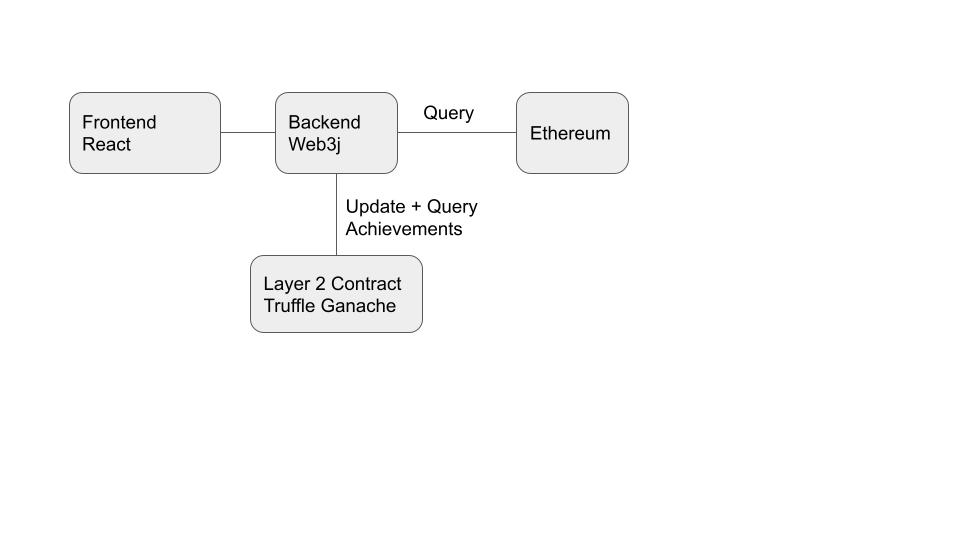

# Defi-Achievements-Overview

Think steam achievements but scaled down. NFT's that are mintable once per address based on address history.

## Value Cases

### Discovery

People like collecting things. People will try things they've never tried before. People will do crazy amounts of stuff (see zapper). Platforms that want to encourage users to try a wider range of their features can create a collection of achievements to encourage people to do so.

### Marketing

Building on the fascination people have with collecting things. Platforms that want to market themselves to users can create achievements tagged with their platform to increase their visibility in the ecosystem. Users will be able to browse through tags and the achievements associated with them on the frontend.

### Easy to use, on-chain index

Retrospective airdrops have often had to do complex historical analysis to figure out the set of addresses to airdrop to. For example, you can figure out which users donated to a Gitcoin grant round using an Alchemy API call. Querying all owners of an NFT is simpler and on chain. If we created an achievement for each Gitcoin grant round it can be used as a shorthand for that Alchemy query. While some achievements will require active participation to claim, we can seed historic achievements to everyone eligible at creation.

### Identity

Achievements are another metric we could use to create a heuristic proof of humanity just like POAP's.

## Architecture Overview

Responsibilities of each component are listed below.

### Backend

* It's a DAL to the layer 2 blockchain where we manage the achievement struct and mint the NFT's.
* It offers a convenient api for the frontend for browsing and minting achievements.
* It is where we run the eligibility queries for an achievement.
* It provides an admin API for manual intervention in the system such as disabling mints, deploying new achievements to the chain, etc.

### Frontend

Wherever possible we keep this focused on display and UX logic such as filtering/sorting.

* The landing page helps users to browse their achievements.

* Users can search for achievements, view the full details of one achievement at a time, and claim achievements and mint their NFT's.

* We may later add analytics pages for achievements about their rarity and such.

### Indexes

Eligibility queries run against various indexes such as Alchemy API, Subgraphs, or basic web3j calls if that can do it.

### L2 Contracts

These maintain the achievement structs and mint NFT's.